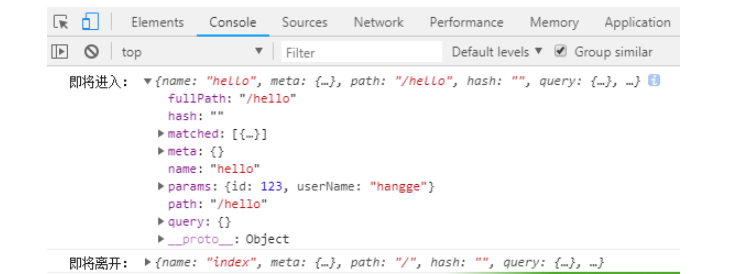

# vue-router
## 1.基础配置
```
<script src="https://unpkg.com/vue/dist/vue.js"></script>
<script src="https://unpkg.com/vue-router/dist/vue-router.js"></script>

<div id="app">
  <h1>Hello App!</h1>
  <p>
    <!-- 使用 router-link 组件来导航. -->
    <!-- 通过传入 `to` 属性指定链接. -->
    <!-- <router-link> 默认会被渲染成一个 `<a>` 标签 -->
    <router-link to="/foo">Go to Foo</router-link>
    <router-link to="/bar">Go to Bar</router-link>
  </p>
  <!-- 路由出口 -->
  <!-- 路由匹配到的组件将渲染在这里 -->
  <router-view></router-view>
</div>
```
```
// 0. 如果使用模块化机制编程，导入Vue和VueRouter，要调用 Vue.use(VueRouter)

// 1. 定义 (路由) 组件。
// 可以从其他文件 import 进来
const Foo = { template: '<div>foo</div>' }
const Bar = { template: '<div>bar</div>' }

// 2. 定义路由
// 每个路由应该映射一个组件。 其中"component" 可以是
// 通过 Vue.extend() 创建的组件构造器，
// 或者，只是一个组件配置对象。
// 我们晚点再讨论嵌套路由。
const routes = [
  { path: '/foo', component: Foo },
  { path: '/bar', component: Bar }
]

// 3. 创建 router 实例，然后传 `routes` 配置
// 你还可以传别的配置参数, 不过先这么简单着吧。
const router = new VueRouter({
  routes // (缩写) 相当于 routes: routes
})

// 4. 创建和挂载根实例。
// 记得要通过 router 配置参数注入路由，
// 从而让整个应用都有路由功能
const app = new Vue({
  router
}).$mount('#app')

// 现在，应用已经启动了！
```
## 2.传参及获取传参
### 2.1用name传递参数
在路由文件src/router/index.js里配置name属性
```
routes: [
    {
      path: '/',
      name: 'Hello',
      component: Hello
    }
]

```
模板里(src/App.vue)用$route.name来接收 比如：<p>{{ $route.name}}</p>
### 2.2 通过\<router-link> 标签中的to传参
src/App.vue文件中
```
<router-link :to="{name:'hi1',params:{username:'jspang',id:'555'}}">Hi页面1</router-link>

```
把src/router/index.js文件里给hi1配置的路由起个name,就叫hi1.
```
{path:'/hi1',name:'hi1',component:Hi1}

```
最后在模板里(src/components/Hi1.vue)用$route.params.username进行接收.
```
{{$route.params.username}}-{{$route.params.id}}

```
### 2.3利用url传递参数----在配置文件里以冒号的形式设置参数。
在/src/router/index.js文件里配置路由
```
{
    path:'/params/:newsId/:newsTitle',
    component:Params
}

```
在src/components目录下建立我们params.vue组件
```
<template>
    <div>
        <h2>{{ msg }}</h2>
        <p>新闻ID：{{ $route.params.newsId}}</p>
        <p>新闻标题：{{ $route.params.newsTitle}}</p>
    </div>
</template>
<script>
export default {
  name: 'params',
  data () {
    return {
      msg: 'params page'
    }
  }
}
</script>

```
在App.vue文件里加入我们的\<router-view>标签。这时候我们可以直接利用url传值了
```
<router-link to="/params/198/jspang website is very good">params</router-link>
```
### 2.4使用path来匹配路由，然后通过query来传递参数
```
<router-link :to="{ name:'Query',query: { queryId:  status }}" >
     router-link跳转Query
</router-link>

//对应路由配置：
   {
     path: '/query',
     name: 'Query',
     component: Query
   }

//获取参数
this.$route.query.queryId

```
## $route.params与$route.query
### $route.params
一个“路径参数”使用冒号 : 标记。当匹配到一个路由时，参数值会被设置到 this.$route.params，可以在每个组件内使用。

```
// /src/router/index.js文件
{
    path:'/params/:newsId/:newsTitle',
    component:Params
}


// src/components/params.vue
<template>
    <div>
        <h2>{{ msg }}</h2>
        <p>新闻ID：{{ $route.params.newsId}}</p>
        <p>新闻标题：{{ $route.params.newsTitle}}</p>
    </div>
</template>
<script>
export default {
  name: 'params',
  data () {
    return {
      msg: 'params page'
    }
  }
}
</script>


//App.vue
<router-link to="/params/198/jspang website is very good">params</router-link>
```
### $route.query
一个 key/value 对象，表示 URL 查询参数。例如，对于路径 /foo?user=1，则有 $route.query.user == 1，如果没有查询参数，则是个空对象。
```
<template>
  <div class="app_page">
    <h1>从这个路由传参到别的路由</h1>
    <router-link :to="{ name:'router1',params: { id: status ,id2: status3},query: { queryId:  status2 }}" >
      router-link跳转router1
    </router-link>
  </div>
</template>
<script>
export default {
  name: 'app_page',
  data () {
    return {
      status:110,
      status2:120,
      status3:119
    }
  },
}
</script>
```
```
<template>
  <div class="router1">
    <h1>接收参数的路由</h1>
    <h1> params.id：{{ $route.params }}</h1>
    <h1>query.status:{{ $route.query.queryId }}</h1>
    <keep-alive>
      <router-view></router-view>
    </keep-alive>
  </div>
</template>
```
### vue-router params和query的区别
- query要用path来引入，params要用name来引入，接收参数都是类似的，分别是this.$route.query.name和this.$route.params.name。
```
this.$router.push({
        path: 'newApply',
        query: {
          type: item.key,
          typeDesc: item.value
        }
      })

http://localhost:8080/workorder/newApply?type=BOX_DEPLOY&typeDesc=%E5%B0%8F%E7%99%BD%E7%9B%92%E9%83%A8%E7%BD%B2
```
```
this.$router.push({
        name: 'newApply',
        params: {
          type: item.key,
          typeDesc: item.value
        }
      })

http://localhost:8080/workorder/newApply
```
- query刷新不会丢失query里面的数据
params刷新会丢失params里面的数据
## 3.子路由

### 3.1首先用\<router-link>标签增加了两个新的导航链接
```
<router-link :to="{name:'HelloWorld'}">主页</router-link>
<router-link :to="{name:'H1'}">H1页面</router-link>
<router-link :to="{name:'H2'}">H2页面</router-link>

```
### 3.2 在HelloWorld.vue加入<router-view>标签，给子模板提供插入位置
```
 <template>
  <div class="hello">
    <h1>{{ msg }}</h1>
    <router-view></router-view>
  </div>
</template>

```
### 3.3 在components目录下新建两个组件模板 H1.vue 和 H2.vue 两者内容类似，以下是H1.vue页面内容：
```
 <template>
  <div class="hello">
    <h1>{{ msg }}</h1>
  </div>
</template>
<script>
  export default {
    data() {
      return {
        msg: 'I am H1 page,Welcome to H1'
      }
    }
  }
</script>

```
### 3.4 修改router/index.js代码，子路由的写法是在原有的路由配置下加入children字段。
```
   routes: [
    {
      path: '/',
      name: 'HelloWorld',
      component: HelloWorld,
      children: [{path: '/h1', name: 'H1', component: H1},//子路由的<router-view>必须在HelloWorld.vue中出现
        {path: '/h2', name: 'H2', component: H2}
      ]
    }
  ]

```
## 4.手动访问和传参
### 4.1 router.push(location, onComplete?, onAbort?)
当你点击 \<router-link> 时，这个方法会在内部调用，所以说，点击 <router-link :to="..."> 等同于调用 router.push(...)。

```
// 字符串
router.push('home')

// 对象
router.push({ path: 'home' })

// 命名的路由
router.push({ name: 'user', params: { userId: '123' }})

// 带查询参数，变成 /register?plan=private
router.push({ path: 'register', query: { plan: 'private' }})

//如果提供了 path，params 会被忽略
const userId = '123'
router.push({ name: 'user', params: { userId }}) // -> /user/123
router.push({ path: `/user/${userId}` }) // -> /user/123
// 这里的 params 不生效
router.push({ path: '/user', params: { userId }}) // -> /user
```
### 4.2 router.replace(location, onComplete?, onAbort?)
跟 router.push 很像，唯一的不同就是，它不会向 history 添加新记录，而是跟它的方法名一样 —— 替换掉当前的 history 记录。

### 4.3 router.go(n)
这个方法的参数是一个整数，意思是在 history 记录中向前或者后退多少步，类似 window.history.go(n)。
```
// 在浏览器记录中前进一步，等同于 history.forward()
router.go(1)

// 后退一步记录，等同于 history.back()
router.go(-1)

// 前进 3 步记录
router.go(3)

// 如果 history 记录不够用，那就默默地失败呗
router.go(-100)
router.go(100)
```
## 5.命名视图

### 5.1在App.vue中设置多个\<router-view>，并给予不同的name:
```
<template>
  <div id="app">
    
       <router-link :to="{name:'HelloWorld'}"><h1>H1</h1></router-link>
       <router-link :to="{name:'H1'}"><h1>H2</h1></router-link>
    <router-view></router-view>
    <router-view name="left" style="float:left;width:50%;background-color:#ccc;height:300px;"/>
    <router-view name="right" style="float:right;width:50%;background-color:yellowgreen;height:300px;"/>
  </div>
</template>

```
### 5.2然后在components中进行相应的配置
```
export default new Router({
    routes: [
      {
        path: '/',
        name: 'HelloWorld',
        components: {default: HelloWorld,
          left:H1,//显示H1组件内容'I am H1 page,Welcome to H1'
          right:H2//显示H2组件内容'I am H2 page,Welcome to H2'
        }
      },
      {
        path: '/h1',
        name: 'H1',
        components: {default: HelloWorld,
          left:H2,//显示H2组件内容
          right:H1//显示H1组件内容
        }
      }
    ]
  })

```
## 6.导航钩子
### 6.1 router.beforeEach--在跳转之前执行
在路由跳转前触发，参数包括to,from,next三个，这个钩子作用主要是用于登录验证，也就是路由还没跳转提前告知，以免跳转了再通知就为时已晚。
```
beforeEach() 方法三个参数介绍：
（1）to：即将要进入的目标路由对象。
（2）frome：当前导航正要离开的路由对象。
（3）next: Function: 一定要调用该方法来 resolve 这个钩子。执行效果依赖 next 方法的调用参数。

   next(): 进行管道中的下一个钩子。这个是必须要的，否在无法完成跳转。

   next(false): 中断当前的导航。就相当于点击之后不会跳转到指定页面，就相当于没有写next()一样。

   next('/') 或者 next({ path: '/' }): 跳转到一个不同的地址。当前的导航被中断，然后进行一个新的导航。你可以向 next 传递任意位置对象，

   next(error): (2.4.0+) 如果传入 next 的参数是一个 Error 实例，则导航会被终止且该错误会被传递给 router.onError() 注册过的回调。
```
```
const router = new Router({ ... })
 
router.beforeEach((to, from, next) => {
  // ...
})
```
```
import Vue from 'vue'
import Router from 'vue-router'
import index from '@/components/index' //引入首页组件
import hello from '@/components/hello' //引入欢迎页组件
 
//Vue全局使用Router
Vue.use(Router)
 
const router =  new Router({
  routes: [ //配置路由，使用数组形式
    {
      path: '/',   //链接路径
      name: 'index',  //路由名称
      component: index//映射的组件
    },
    {
      path: '/hello',
      name: 'hello',
      component: hello
    }
  ]
})
 
//全局路由改变前钩子
router.beforeEach((to, from, next) => {
  console.log('即将进入：', to);
  console.log('即将离开：', from);
  next();
})
 
export default router
```
  
- 验证用户权限。  
我们在做网站登录验证的时候，可以使用到beforeEach 钩子函数进行验证操作，如下面代码 ，如果页面path为’/goodsList’，那么就让它跳转到登录页面，实现了验证登录。
```
router.beforeEach((to, from, next) => {
  if (to.path === '/goodsList') {
    next('/login')
  } else 
    next()
})
```
- $route.matched  
一个数组，包含当前路由的所有嵌套路径片段的路由记录 。它的第一项就是{path: “/goodslist”}，一直到最为具体的当前path （例如：{path: “/goodslist/online/edit”}）  
这里可以循环matched这个数组，看每一项的path 有没有等于’/goodsList’,只要其中一个有，那么就让它跳转到登录状态
```
router.beforeEach((to, from, next) => {
  if (to.matched.some(function (item) {
    return item.path == '/goodslist'
  })) {
    next('/login')
  } else 
    next()
})
```
## 7.元数据及路由匹配
vue-router路由元信息说白了就是通过meta对象中的一些属性来判断当前路由是否需要进一步处理，如果需要处理，按照自己想要的效果进行处理即可！
### 7.1 路由元信息：定义路由的时候可以配置 meta 字段
```
const router = new VueRouter({
  routes: [
    {
      path: '/foo',
      component: Foo,
      children: [
        {
          path: 'bar',
          component: Bar,
          // a meta field
          meta: { requiresAuth: true }
        }
      ]
    }
  ]
})
```
在全局导航守卫中检查元字段
```
router.beforeEach((to, from, next) => {
  if (to.matched.some(record => record.meta.requiresAuth)) {
    // this route requires auth, check if logged in
    // if not, redirect to login page.
    if (!auth.loggedIn()) {
      next({
        path: '/login',
        query: { redirect: to.fullPath }
      })
    } else {
      next()
    }
  } else {
    next() // 确保一定要调用 next()
  }
})
```
- 1、meta 字段就是路由元信息字段，requiresAuth 是自己起的字段名称，用来标记这个路由信息是否需要检测，true 表示要检测，false 表示不需要检测（这个名称随便起)
- 2、if (to.matched.some(record => record.meta.requiresAuth) )，这句话就是返回遍历的某个路由对象，我们定义为为record，检测这个对象是否拥有meta这个对象，如果有meta这个对象，检测它的meta对象是不是有requiresAuth这个属性，且为true，如果满足上述条件，就确定了是这个/foo/bar路由。
## 8.$route 和 $router 的区别
- $route 是“路由信息对象”，包括 path，params，hash，query，fullPath，matched，name 等路由信息参数。
```
① $route.path
字符串，对应当前路由的路径，总是解析为绝对路径，如 "/order"。
② $route.params
一个 key/value 对象，包含了 动态片段 和 全匹配片段，
如果没有路由参数，就是一个空对象。
③ $route.query
一个 key/value 对象，表示 URL 查询参数。
例如，对于路径 /foo?user=1，则有 $route.query.user为1，
如果没有查询参数，则是个空对象。
④ $route.hash
当前路由的 hash 值 (不带 #) ，如果没有 hash 值，则为空字符串。
⑤ $route.fullPath
完成解析后的 URL，包含查询参数和 hash 的完整路径。
⑥ $route.matched
数组，包含当前匹配的路径中所包含的所有片段所对应的配置参数对象。
⑦ $route.name   当前路径名字

```
- $router 是“路由实例”对象，即使用 new VueRouter创建的实例，包括了路由的跳转方法，钩子函数等
```
<button @click="goToMenu" class="btn btn-success">Let's order！</button>
.....
<script>
  export default{
    methods:{
      goToMenu(){
        this.$router.go(-1)//跳转到上一次浏览的页面
        this.$router.replace('/menu')//指定跳转的地址
        this.$router.replace({name:'menuLink'})//指定跳转路由的名字下
        this.$router.push('/menu')//通过push进行跳转
        this.$router.push({name:'menuLink'})//通过push进行跳转路由的名字下
      }
    }
  }
</script>

```
## 9.设置404页面
/src/router/index.js
```
{
   path:'*',
   component:Error
}

```
在/src/components/文件夹下新建一个Error.vue的文件
```
<template>
    <div>
        <h2>{{ msg }}</h2>
    </div>
</template>
<script>
export default {
  data () {
    return {
      msg: 'Error:404'
    }
  }
}
</script>

```