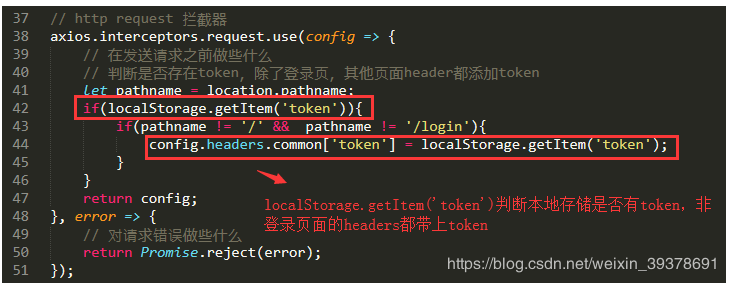
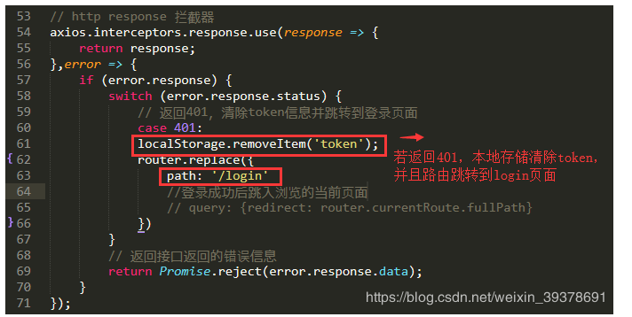

# axios拦截器
http 是无状态协议 所以每次请求都需要使用唯一识别的token去判断是那个用户  
axios拦截器就是用于封装 在每次请求过程都 将请求的数据进行拦截

## 请求拦截器
请求拦截器的作用是在请求发送前进行一些操作，例如在每个请求体里加上token，统一做了处理如果以后要改也非常容易。
```
axios.interceptors.request.use(function (config) {
    // 在发起请求请做一些业务处理
    return config;
  }, function (error) {
    // 对请求失败做处理
    return Promise.reject(error);
  });
```
  
利用vuex设置请求拦截：
```
// 先导入vuex,因为我们要使用到里面的状态对象
// vuex的路径根据自己的路径去写
import store from '@/store/index';

// 请求拦截器
axios.interceptors.request.use(    
    config => {        
        // 每次发送请求之前判断vuex中是否存在token        
        // 如果存在，则统一在http请求的header都加上token，这样后台根据token判断你的登录情况
        // 即使本地存在token，也有可能token是过期的，所以在响应拦截器中要对返回状态进行判断 
        const token = store.state.token;        
        token && (config.headers.Authorization = token);        
        return config;    
    },    
    error => {        
        return Promise.error(error);    
})

```
## 响应拦截器
响应拦截器的作用是在接收到响应后进行一些操作，例如在服务器返回登录状态失效，需要重新登录的时候，跳转到登录页。
```
 axios.interceptors.response.use(function (response) {
    // 对响应数据做处理
    return response;
  }, function (error) {
    // 对响应错误做处理
    return Promise.reject(error);
  });
```

```
// 响应拦截器
axios.interceptors.response.use(    
    response => {   
        // 如果返回的状态码为200，说明接口请求成功，可以正常拿到数据     
        // 否则的话抛出错误
        if (response.status === 200) {            
            return Promise.resolve(response);        
        } else {            
            return Promise.reject(response);        
        }    
    },    
    // 服务器状态码不是2开头的的情况
    // 这里可以跟你们的后台开发人员协商好统一的错误状态码    
    // 然后根据返回的状态码进行一些操作，例如登录过期提示，错误提示等等
    // 下面列举几个常见的操作，其他需求可自行扩展
    error => {            
        if (error.response.status) {            
            switch (error.response.status) {                
                // 401: 未登录
                // 未登录则跳转登录页面，并携带当前页面的路径
                // 在登录成功后返回当前页面，这一步需要在登录页操作。                
                case 401:                    
                    router.replace({                        
                        path: '/login',                        
                        query: { 
                            redirect: router.currentRoute.fullPath 
                        }
                    });
                    break;

                // 403 token过期
                // 登录过期对用户进行提示
                // 清除本地token和清空vuex中token对象
                // 跳转登录页面                
                case 403:
                     Toast({
                        message: '登录过期，请重新登录',
                        duration: 1000,
                        forbidClick: true
                    });
                    // 清除token
                    localStorage.removeItem('token');
                    store.commit('loginSuccess', null);
                    // 跳转登录页面，并将要浏览的页面fullPath传过去，登录成功后跳转需要访问的页面 
                    setTimeout(() => {                        
                        router.replace({                            
                            path: '/login',                            
                            query: { 
                                redirect: router.currentRoute.fullPath 
                            }                        
                        });                    
                    }, 1000);                    
                    break; 

                // 404请求不存在
                case 404:
                    Toast({
                        message: '网络请求不存在',
                        duration: 1500,
                        forbidClick: true
                    });
                    break;
                // 其他错误，直接抛出错误提示
                default:
                    Toast({
                        message: error.response.data.message,
                        duration: 1500,
                        forbidClick: true
                    });
            }
            return Promise.reject(error.response);
        }
    }    
});
```
## 将axios实例暴露出去
```
export default service;
```
