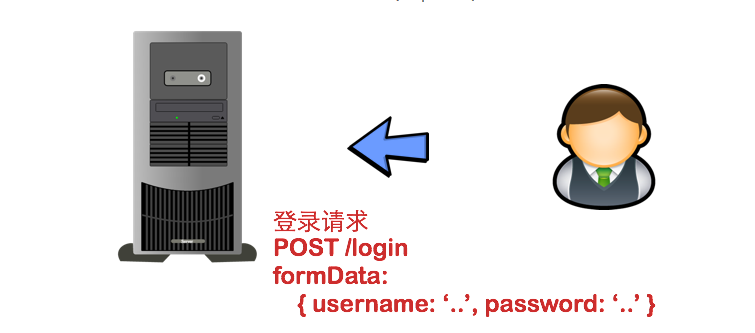
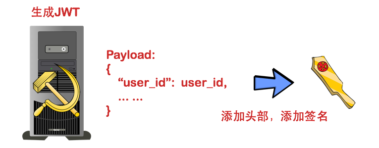
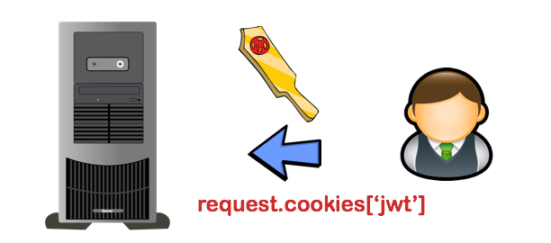
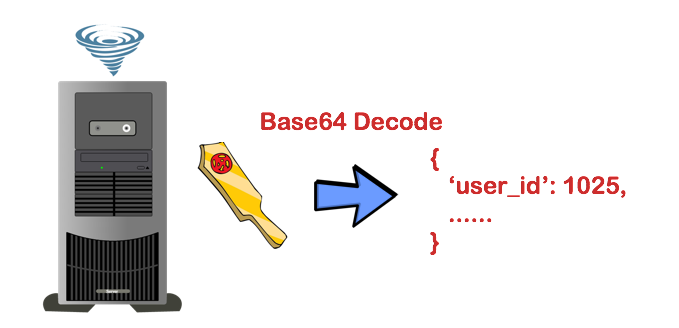
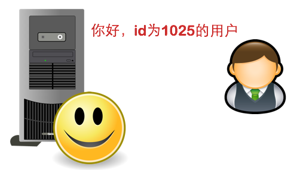

# 使用JWT设计的单点登录系统
**用户认证**：就是让用户登录，并且在接下来的一段时间内让用户访问网站时可以使用其账户，而不需要再次登录的机制。  
以下为用户认证的步骤：  
1. 服务器应用（下面简称“应用”）让用户通过Web表单将自己的用户名和密码发送到服务器的接口。这一过程一般是一个HTTP POST请求。建议的方式是通过SSL加密的传输（https协议），从而避免敏感信息被嗅探。
   
2. 应用和数据库核对用户名和密码。
   
3. 核对用户名和密码成功后，应用将用户的id（图中的user_id）作为JWT Payload的一个属性，将其与头部分别进行Base64编码拼接后签名，形成一个JWT。这里的JWT就是一个形同lll.zzz.xxx的字符串。
   
4. 应用将JWT字符串作为该请求Cookie的一部分返回给用户。注意，在这里必须使用HttpOnly属性来防止Cookie被JavaScript读取，从而避免跨站脚本攻击（XSS攻击）。
   
5. 在Cookie失效或者被删除前，用户每次访问应用，应用都会接受到含有jwt的Cookie。从而应用就可以将JWT从请求中提取出来。
   
6. 应用通过一系列任务检查JWT的有效性。例如，检查签名是否正确；检查Token是否过期；检查Token的接收方是否是自己（可选）。
   
7. 应用在确认JWT有效之后，JWT进行Base64解码（可能在上一步中已经完成），然后在Payload中读取用户的id值，也就是user_id属性。这里用户的id为1025。
   
8. 应用从数据库取到id为1025的用户的信息，加载到内存中，进行ORM之类的一系列底层逻辑初始化。
   
9.  应用根据用户请求进行响应。
    