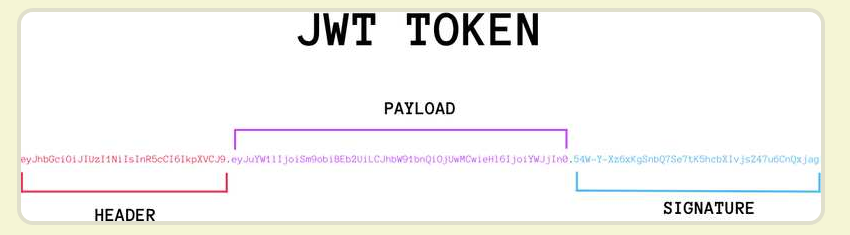
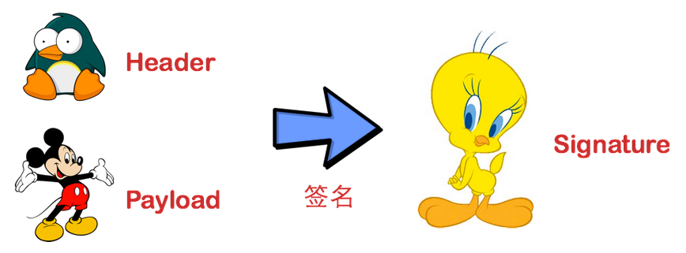
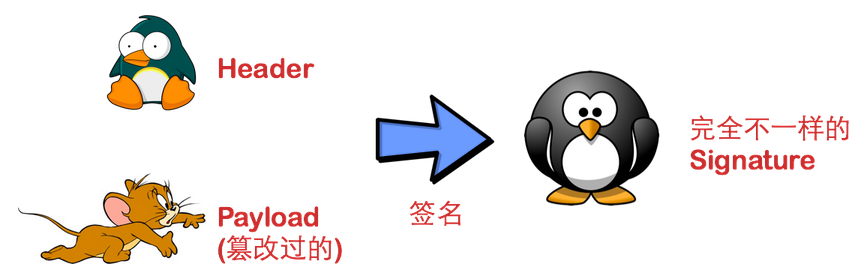

# JWT(JSON Web Token)
这个规范允许我们使用JWT在用户和服务器之间传递安全可靠的信息。
## 1.组成
- 头部(Header)
- 载荷(Payload)
- 签名(Signature)

实际的JWT是一个很长的字符串，中间用点(.)分隔成三部分。



### 头部(Header)
头部用于描述关于该JWT的最基本的信息，例如其类型以及签名所用的算法等。这也可以被表示成一个JSON对象。
```
{
    "typ":"JWT",
    "alg":"HS256"
}
```
alg属性表示签名的算法（algorithm），默认是 HMAC SHA256（写成 HS256）；typ属性表示这个令牌（token）的类型（type），JWT 令牌统一写为JWT。  
将上面的 JSON 对象使用 Base64URL 算法转成字符串。
### 载荷(Payload)
Payload 部分也是一个 JSON 对象，用来存放实际需要传递的数据。JWT 规定了7个官方字段，供选用。
```
iss (issuer)：签发人
exp (expiration time)：过期时间
sub (subject)：主题
aud (audience)：受众
nbf (Not Before)：生效时间
iat (Issued At)：签发时间
jti (JWT ID)：编号
```
### 签名(Signature)
Signature 部分是对前两部分的签名，防止数据篡改。  
  

首先，需要指定一个密钥（secret）。这个密钥只有服务器才知道，不能泄露给用户。然后，使用 Header 里面指定的签名算法（默认是 HMAC SHA256），按照下面的公式产生签名。  
```
HMACSHA256(
  base64UrlEncode(header) + "." +
  base64UrlEncode(payload),
  secret)
```  
算出签名以后，把 Header、Payload、Signature 三个部分拼成一个字符串，每个部分之间用"点"（.）分隔，就可以返回给用户。  
       


### Base64URL
JWT 作为一个令牌（token），有些场合可能会放到 URL（比如 api.example.com/?token=xxx）。Base64 有三个字符+、/和=，在 URL 里面有特殊含义，所以要被替换掉：=被省略、+替换成-，/替换成_ 。这就是 Base64URL 算法。

## 2.JWT的使用方式
- HTTP 请求的头信息Authorization字段里面
  ```
  Authorization: Bearer <token>
  ```
- 通过url传输
  ```
  http://www.xxx.com/pwa?token=xxxxx
  ```

如果是post请求也可以放在请求体中
