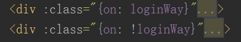
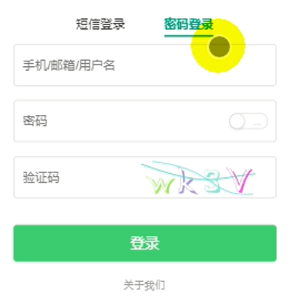
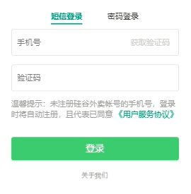

## 1.状态切换
利用标识变量来动态选择显示的状态。  
利用 :class{on:loginWay}来确定是否实现类on中的功能    
```
data () {
      return {
        loginWay: false, // true代表短信登陆, false代表密码
      }
    },


<a href="javascript:;" :class="{on: loginWay}" @click="loginWay=true">短信登录</a>
<a href="javascript:;" :class="{on: !loginWay}" @click="loginWay=false">密码登录</a>

```



  
## 2.验证码
