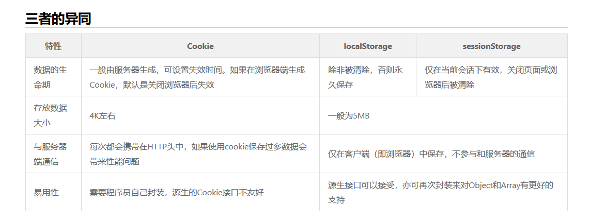

# 1.Cookie
它的主要用途有保存登录信息，比如你登录某个网站市场可以看到“记住密码”，这通常就是通过在 Cookie 中存入一段辨别用户身份的数据来实现的。
# 2.LocalStorage
localStorage 用于存储一个域名下的需要永久存在在本地的数据，这些数据可以被一直访问，直到这些数据被删除。
# 3.SessionStorage
 sessionStorage 是一个前端的概念，它只是可以将一部分数据在当前会话中保存下来，刷新页面数据依旧存在。但当页面关闭后，sessionStorage 中的数据就会被清空。  
   
   

# 应用场景
因为考虑到每个 HTTP 请求都会带着 Cookie 的信息，所以 Cookie 当然是能精简就精简啦，比较常用的一个应用场景就是判断用户是否登录。针对登录过的用户，服务器端会在他登录时往 Cookie 中插入一段加密过的唯一辨识单一用户的辨识码，下次只要读取这个值就可以判断当前用户是否登录啦。

而另一方面 localStorage 接替了 Cookie 管理购物车的工作，同时也能胜任其他一些工作。比如HTML5游戏通常会产生一些本地数据，localStorage 也是非常适用的。如果遇到一些内容特别多的表单，为了优化用户体验，我们可能要把表单页面拆分成多个子页面，然后按步骤引导用户填写。这时候 sessionStorage 的作用就发挥出来了。